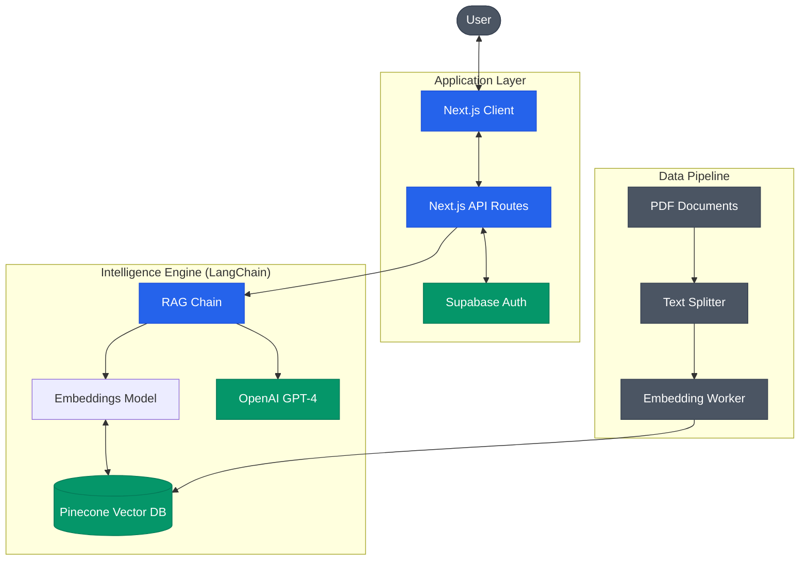

# Kaattaal AI

> **Know All about Kattakada LAC Instantly**

Kaattaal AI is an advanced RAG-powered intelligence platform that democratizes access to district information. By combining vector search with large language models, it allows users to interact naturally with complex government documents, development data, and statistical reports in both English and Malayalam.

## 🏗️ System Architecture



## 🛠️ Tech Stack

- **Framework:** Next.js 16 (App Router)
- **Language:** TypeScript 5+
- **Styling:** Tailwind CSS 4, Framer Motion, Radix UI
- **AI Orchestration:** LangChain
- **Vector Database:** Pinecone
- **LLM:** OpenAI GPT Models
- **Auth & Storage:** Supabase

## 📂 Project Structure

```bash
├── src
│   ├── app          # Next.js App Router pages and API endpoints
│   ├── components   # Reusable UI components (shadcn/ui + custom)
│   ├── lib          # Core utilities, LangChain setups, and types
│   ├── scripts      # ETL pipelines for processing PDF documents
│   └── styles       # Global styles and Tailwind configuration
├── public           # Static assets (images, fonts)
└── scripts          # Build and deployment scripts
```

## 🚀 Getting Started

### Prerequisites
- Node.js 20+
- OpenAI API Key
- Pinecone API Key & Index

### Installation

1. **Clone & Install**
   ```bash
   git clone <repo-url>
   cd kattal-ai
   npm install
   ```

2. **Environment Setup**
   Create a `.env.local` file:
   ```env
   OPENAI_API_KEY=sk-...
   PINECONE_API_KEY=...
   PINECONE_INDEX_NAME=...
   NEXT_PUBLIC_SUPABASE_URL=...
   NEXT_PUBLIC_SUPABASE_ANON_KEY=...
   ```

3. **Run Development Server**
   ```bash
   npm run dev
   ```

## ⚡ Key Scripts

| Script | Description |
|--------|-------------|
| `npm run dev` | Start development server with Turbopack |
| `npm run build` | Production build |
| `npm run prepare:data` | Run ETL pipeline to chunk and embed documents |
| `npm run process:malayalam` | Specialized pipeline for Malayalam content |
| `npm run analyze:database` | Diagnostics for vector database health |

## 📄 License

This project is licensed under the MIT License.